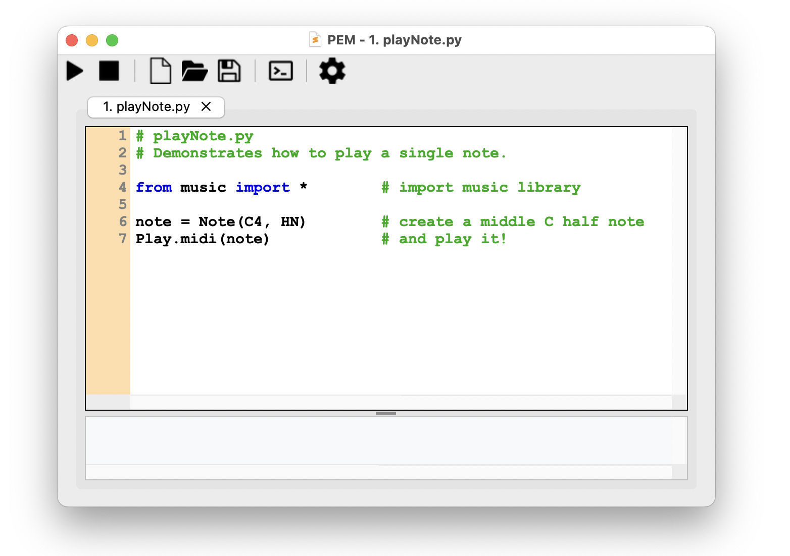

# Download

## Platforms

PythonMusic runs on Windows, Mac, and Linux.

## Download and Install

To install PythonMusic, simply download **PEM** (Python Environment for Music) editor. _(Latest %%version%% - %%date%%)_

<figure markdown="span">
  
  <!-- <figcaption>PEM editor window (in MacOS)</figcaption> -->
</figure>

PEM is bundled with all PythonMusic libraries, and other essential Python libraries.  It should be enough for most uses. 

**NOTE:** For more advanced users, see [install PythonMusic via ```pip```](#install-via-pip-advanced). 

### Windows

1. [Download PEM for Windows](https://github.com/ydhadix/PythonMusic/releases/latest/download/PEM-Windows.zip).
2. Unzip the downloaded file.
3. Double-click **PEM.exe** to run.
4. (Optional) Right-click PEM.exe, and select "Create Shortcut". Move this shortcut to your Desktop for easy access.

### Mac

1. [Download PEM for MacOS](https://github.com/ydhadix/PythonMusic/releases/latest/download/PEM-macOS-AppleSilicon.tar.gz).
2. Double-click the downloaded file to extract **PEM**.
3. Move **PEM** to your Applications folder.
4. Double-click PEM to run.
5. (Optional) While PEM is running, control-click the PEM icon on the taskbar. Select “Options” and “Keep in Dock” for easy access.

#### Mac Security Issue

Some versions of MacOS flag the PEM application as damaged (or malware).  This is a common issue caused by Apple's strict security protocols, and does not mean the application is unsafe. If so:

1. Select “Cancel” (not "Move to Trash"!).
2. Open System Settings. 
3. In “Privacy & Security”, scroll down to see a Security alert for PEM. 
4. Select “Allow”, and open PEM again.

Alternatively - after you move PEM to the Applications folder:

1. Open a Terminal window.
2. Type this command: 

```
sudo xattr -dr com.apple.quarantine /Applications/PEM.app/
```

### Linux (and Intel Mac)

The PEM executable is not available for Linux and Intel-based Macs.

To install PythonMusic see [install via pip](#install-via-pip-advanced).

### Previous Versions

Need an older release?  All previous versions of PEM and PythonMusic are available on the [PythonMusic releases page](https://github.com/ydhadix/PythonMusic/releases) on GitHub.

---

## Download the Examples

PythonMusic comes with [online examples](examples/index.md).  You can also [download them](examples/PythonMusic_Examples.zip){ download }.


---

## Install via pip (Advanced)

For more advanced users, install PythonMusic via ```pip```.  This provides access to the full Python ecosystem of libraries:

1. Make sure you have [Python3](https://www.python.org/downloads/) installed (version 3.12 or greater). 
2. Open Terminal, and type: 

```
pip install PythonMusic
```

**TIP:** PythonMusic works on Python 3.12 and later, but Python 3.12 is the smoothest install.  A few of PythonMusic's dependencies don't yet offer ready-made versions for Python 3.13 and 3.14, so on those versions ```pip``` has to build them on your computer — which needs the extra tools described under [Troubleshooting](#troubleshooting).  If you'd rather not set those up, install Python 3.12.


### PEM

Once PythonMusic is installed with ```pip```, you can access PEM via the command line:  


```
python -m pem
``` 
or simply: 

```
pem
```  

You can also open a file with PEM:

```
python -m pem <filename.py>
```

or

```
pem <filename.py>
```

### Troubleshooting

Most ```pip install``` problems come from the same cause.  A few of PythonMusic's dependencies are written partly in C or C++.  When a ready-made version isn't available for your computer, ```pip``` builds that dependency from its source code instead — and building needs tools that don't come with Python.

You are seeing this if the installation stops with a message like:

- ```CMake configuration failed```
- ```Failed building wheel for python-rtmidi```
- ```Failed building wheel for pyaudio```
- ```error: command 'clang' failed```
- ```error: Microsoft Visual C++ 14.0 or greater is required```

The fix is to install the missing tools, then run ```pip install PythonMusic``` again.

#### Step 1: Install the C/C++ build tools

This is what ```pip``` needs in order to build anything at all, and it resolves most of the errors above.

- **On Windows**, download and install [Visual Studio Build Tools 2022](https://visualstudio.microsoft.com/downloads/).  In the Visual Studio installer, make sure "Desktop Development with C++" is checked.

- **On MacOS**, open Terminal and type:

```
xcode-select --install
```

A dialog will appear — click "Install" to install Apple's Command Line Tools and wait for it to finish.

Restart your computer, then try installing PythonMusic again.

#### Step 2 (MacOS only): Install PortAudio

If the installation still stops with ```Failed building wheel for pyaudio```, or mentions ```fatal error: 'portaudio.h' file not found```, you also need PortAudio — a sound library that PythonMusic uses to play audio.

The easiest way to get it is with [Homebrew](https://brew.sh), a package manager for MacOS.  If you don't already have Homebrew, follow the one-line install command on [brew.sh](https://brew.sh).  Then, in Terminal, type:

```
brew install portaudio
```

Then try installing PythonMusic again.

---
## Test your Installation

To verify that your environment is set up correctly, run the following "Hello, World!" program:

```python linenums="1" title="playNote.py"
--8<-- "examples/_snippets/playNote.py"
```

You can run this in one of two ways:

- **Using PEM:** Copy and paste the code above directly into the PEM editor, and click "Run".

- **Using the command line:** Save the code in a file named ```playNote.py```, and run it from your terminal (notice the "-i", which stands for interactive mode):

```
python -i playNote.py
```

**NOTE**: The first time you import music and run a program, PythonMusic will ask to download a high-quality soundfont (FluidR3 G2-2.sf2) for you. This is necessary to play high-quality MIDI sounds, and only needs to happen once.

If you hear this note playing, everything is perfect!

<audio controls preload="none" src="../../audio/playNote.wav"></audio>


---

